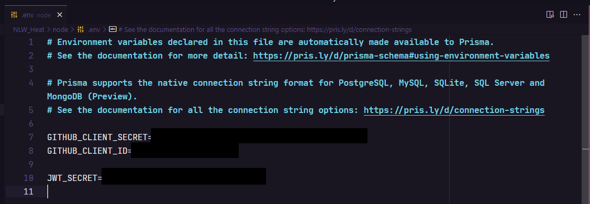

 <div align="center" id="top">
  <p align="center">
  	
  </p>
</div>

 <hr/>

<h1 align="center"> NLW Heat </h1>

<p align="center">
   
   
   
   
   
	
</p>	

<p align="center">
  <a href="#dart-about"> About </a> &#xa0; | &#xa0; 
  <a href="#computer-technologies-used"> Technologies used </a> &#xa0; | &#xa0; 
  <a href="#white_check_mark-requirements"> Requirements </a> &#xa0; | &#xa0; 
  <a href="#checkered_flag-starting"> Starting </a> &#xa0; | &#xa0; 
  <a href="#books-where-to-learn-more"> Where to learn more </a> &#xa0; | &#xa0;
  <a href="#unlock-license"> License </a> &#xa0; | &#xa0;
  <a href="https://www.linkedin.com/in/luiza-lissandra/" target="_blank"> Developer </a>
</p>

<br>

## :dart: About ##

Project developed in the 7th edition of Next Level Week of <a href='https://rocketseat.com.br'> Rocketseat</a>, a free event that
aims to take you to the next level :rocket:. The trail I chose was the intermediate one, Impulse, ideal for someone who has been programming for some time.

## :computer: Technologies used ##

- [NodeJS](https://nodejs.org/pt-br/) 
- [ReactJS](https://pt-br.reactjs.org/)
- [React Native](https://reactnative.dev/) [:warning:SOON]
- [Elixir](https://elixir-lang.org/) [:warning:SOON]

### Back-end

- On the back-end, the main technologies used were <a href='https://nodejs.org/pt-br/'> NodeJS</a>, <a href='https://www.typescriptlang.org/'> Typescript</a>, <a href='https://prisma.io/'> Prisma</a>, <a href='https://socket.io/'> Socket.io </a> and <a href='https://www.sqlite.org/index.html'> SQLite</a>. 

- To test the application's routes, <a href='https://insomnia.rest/'> Insomnia </a> was used. 
Use the configuration I used through the button below:

[](https://insomnia.rest/run/?label=NLW%20Heat&uri=https%3A%2F%2Fraw.githubusercontent.com%2FLissandraRodrigues%2FNLW_Heat%2Fmaster%2Finsomnia)

### Front-end: ReactJS

- On the front-end, the main technologies used were <a href='https://pt-br.reactjs.org/'> ReactJS</a>, <a href='https://www.typescriptlang.org/'> Typescript</a>, <a href='https://vitejs.dev/'> Vite</a>, <a href='https://styled-components.com/'> Styled Components</a> and <a href='https://sass-lang.com/'> SASS</a>. 

## :white_check_mark: Requirements ##

Before starting :checkered_flag:, you need to have [Git](https://git-scm.com) and [Node](https://nodejs.org/pt-br/) installed.

## :checkered_flag: Starting ##

### Back-end: <a href = 'https://github.com/LissandraRodrigues/NLW_Heat/tree/master/node'> Node </a>

- Open your terminal and do the following commands:

```bash
# Clone the folder.
$ git clone https://github.com/LissandraRodrigues/NLW_Heat/tree/master/node

# Access it.
$ cd node

# Create an .env file inside the node folder.
$ touch .env
```

- Go to your GitHub account -> Settings -> Developer Settings -> OAuthApps, create a new OAuth App, generate a client secret and put it in the .env file, along with the client ID and some random code for JWT_SECRET (Could be literally anything) as in the example below:



- Now just follow the step by step below on your terminal:

```bash
# Install dependencies.
$ yarn install 
or $ npm install

# Run the migrations.
$ yarn prisma migrate dev 
or $ npm prisma migrate dev

# Run the project.
$ yarn dev 
or $ npm dev
```

### Front-end: <a href = 'https://github.com/LissandraRodrigues/NLW_Heat/tree/master/web'> ReactJS </a>

- Open your terminal and do the following commands:

```bash
# Clone the folder.
$ git clone https://github.com/LissandraRodrigues/NLW_Heat/tree/master/web

# Access it.
$ cd web

# Install dependencies.
$ yarn install 
or $ npm install

# Run the project.
$ yarn dev 
or $ npm dev
```

## :books: Where to learn more ##

- <a href='https://www.youtube.com/c/RocketSeat/featured'> Rocketseat Youtube Channel </a>
- <a href='https://www.rocketseat.com.br/discover'> Rocketseat Free Courses </a>
- <a href='https://www.notion.so/dev-letter-e59ace6284a044b88fc5a9945ae326de'> Rocketseat Newsletter </a>
- <a href='https://blog.rocketseat.com.br/'> Rocketseat Blog </a>
- <a href='https://open.spotify.com/show/3TNsKUGlP9YbV1pgy3ACrW'> Rocketseat Podcast </a>

## :unlock: License ##

This project is under license from MIT. To learn more, see [LICENSE](LICENSE). 

<hr/>

Developed with ❤ by <a href="https://www.linkedin.com/in/luiza-lissandra/" target="_blank"> Luiza Lissandra :rocket: </a>

&#xa0;

<a href="#top"> Back to top </a>
